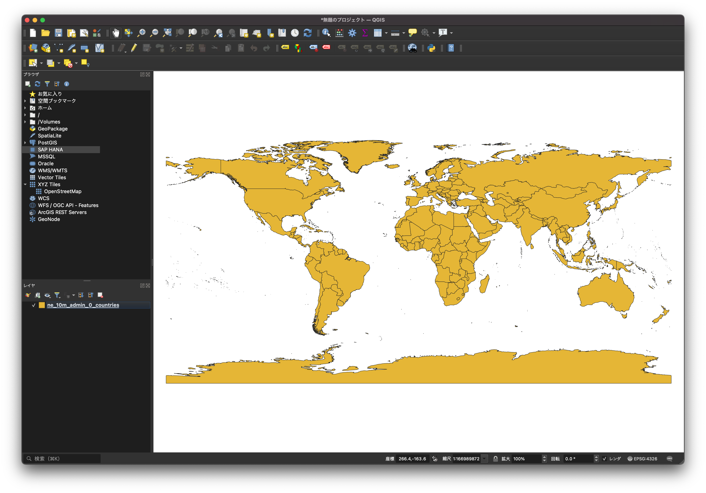

## 世界地図の白地図

世界地図を表示するにはOpenStreetMapなど便利なタイルを使うことができますが、歴史的な表現をする場合には白地図から開始した方が良いこともあります。

世界地図のデータとしては[Natural Earth](https://www.naturalearthdata.com/)が利用可能ですが、執筆現在でダウンロードに問題があります。代わりにNatural Earthの[Github](https://github.com/nvkelso/natural-earth-vector)からダウンロードするという方法があり、執筆現在ではこちらからダウンロードをするのをお勧めします。

まず、Githubのページに移動します。そして、Releaseの箇所をクリックします。

次に、Releaseページの一番下にある`Source code(zip)`をダウンロードします。

なお、Natural Earthの全てのファイルをダウンロードすることになるので、時間がかかります。ただし、Natural Earthのデータは多岐にわたっているので、白地図以外のデータの作成にも使えるのでダウンロードしておいて損はありません。

ダウンロードが終わったらファイルを展開して、中にある`10m_cultural/ne_10m_admin_0_countries.shp`をQGISで開きます。

初期状態では色がついているので、レイヤを選択して右クリックからプロパティを開き、色を変更しましょう。

色が白く変更されたら作成が完了です。

あとは使いませるようにプロジェクトファイルを保存しておくと便利です。また、Shapefileは取り回しが面倒なので、GeoPackageなどにしておくとさらに便利になります。
